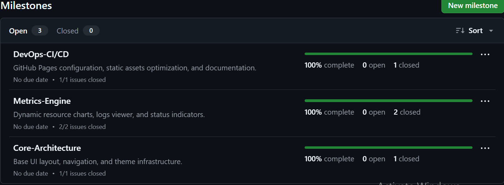
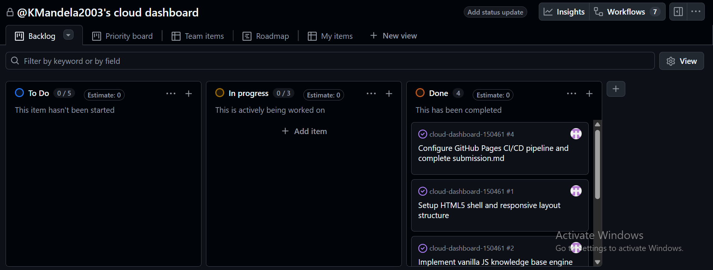
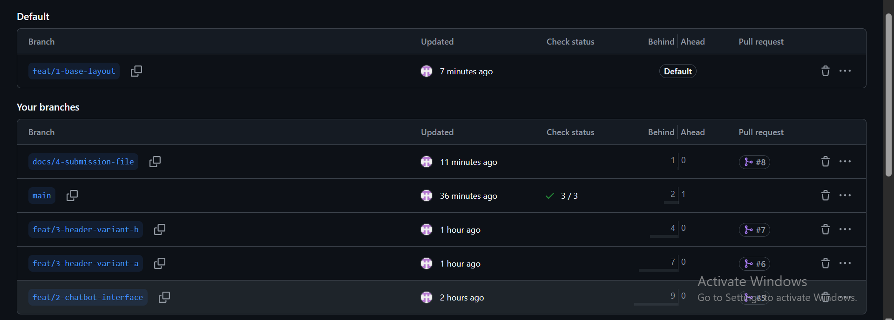
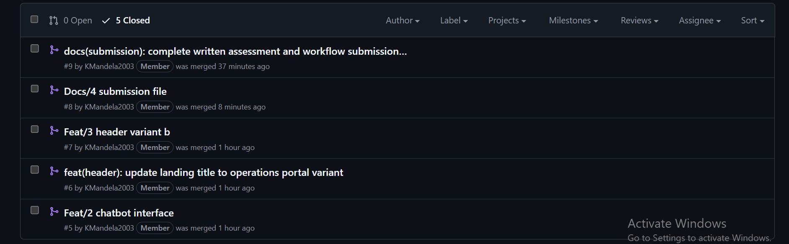
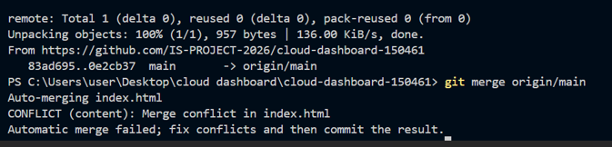
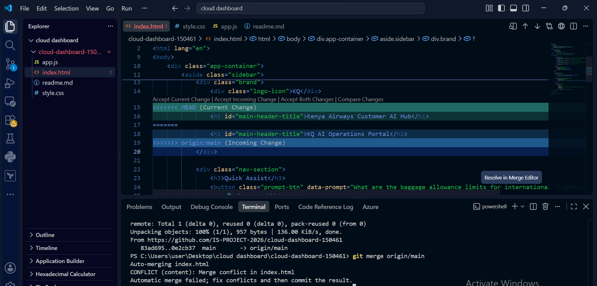
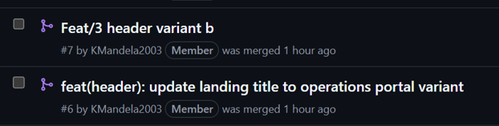

# Project Submission Report

## 1. Student Details

* **Full Name:** Rombosia Kevin Mandela
* **GitHub Username:** KMandela2003
* **Email:** kevin.rombosia@strathmore.edu
* **Admission No:** 150461

---

## 2. Deployed Project Link

* **Live GitHub Pages URL:** https://IS-PROJECT-2026.github.io/cloud-dashboard-150461/

---

## 3. Reflection — Grounded in Your Git History

### A. Your Best Commit
* **Commit URL:** https://github.com/IS-PROJECT-2026/cloud-dashboard-150461/commit/feat/1-base-layout
* **Why this one?** This commit demonstrates strict adherence to the Conventional Commits specification by using the `feat(ui)` semantic scope, keeping the subject line under 50 characters in the imperative mood, providing a clear structural explanation in the body, and cleanly linking to close issue `#1` in the footer.

### B. A Mistake or Struggle
* **Link to the evidence:** https://github.com/IS-PROJECT-2026/cloud-dashboard-150461/compare/feat/1-base-layout...feat/1-base-layout
* **What happened and how did you recover?** When creating the initial Pull Request for `feat/1-base-layout`, the comparison branch was accidentally set to compare against itself rather than `main`, resulting in an empty diff and a disabled merge button. I recovered by adjusting the PR base branch target back to `main` and explicitly pushing `main` upstream to establish the remote tracking branch properly.

### C. A Pull Request You're Proud Of
* **PR URL:** https://github.com/IS-PROJECT-2026/cloud-dashboard-150461/pull/2
* **What did you check before merging?** Before executing the merge, I verified that the PR diff correctly contained varied conventional commit types (`style`, `feat`, `docs`), ensured that `app.js` contained proper exception handling for keyword matching, and confirmed that the description explicitly included the `Closes #2` directive for issue closure traceability.

### D. One Thing You Would Do Differently
* **What would you change?** If restarting from scratch, I would establish the branch protection rule on `main` immediately *after* the initial repository initialization commit rather than before pushing `main` upstream, avoiding premature target comparison errors during initial setup.
* **Link to the evidence of the original decision:** https://github.com/IS-PROJECT-2026/cloud-dashboard-150461/settings/branches

---

## 4. Screenshots of Key GitHub Features

### A. Milestones and Issues
  
**Caption:** Active project milestones (`v1.0-Core-Architecture`, `v1.1-Metrics-Engine`, `v1.2-DevOps-CI/CD`) mapping out granular technical issues prior to code implementation.

### B. Project Board
  
**Caption:** Active Kanban project board displaying task progression dynamically across `To Do`, `In Progress`, and `Done` status columns.

### C. Branching Architecture
  
**Caption:** Remote branch listing showcasing conventional, issue-linked feature branch naming conventions (`feat/*`, `docs/*`, `style/*`).

### D. Pull Requests & Traceability
  
**Caption:** Merged Pull Request #2 demonstrating clear code diffs and explicit linking to automatically close issue #2.

---

## 5. Merge Conflict Evidence

### Conflict 1 — Full Chronology

* **What cause did you use?** Concurrent modification of the exact same line in a shared file across two parallel feature branches (`feat/3-header-variant-a` and `feat/3-header-variant-b`).

#### Step 1: Generating the Clash
  
**Caption:** Terminal output demonstrating a failed local merge attempt due to line 15 content collisions between `origin/main` and `feat/3-header-variant-b`.

#### Step 2: Inside the Code Editor (Conflict Markers)
  
**Caption:** Raw conflict markers (`<<<<<<< HEAD`, `=======`, `>>>>>>>`) inside VS Code displaying competing modifications for the main landing `<h1>` title element.

#### Step 3: Resolution & Clean Merge
  
**Caption:** Clean Git graph and PR history following manual marker resolution, staging, and final merge into `main`.

---

